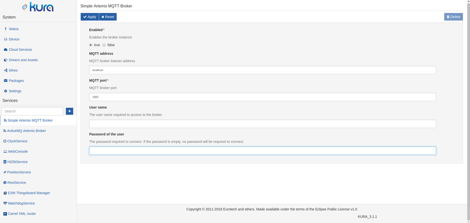
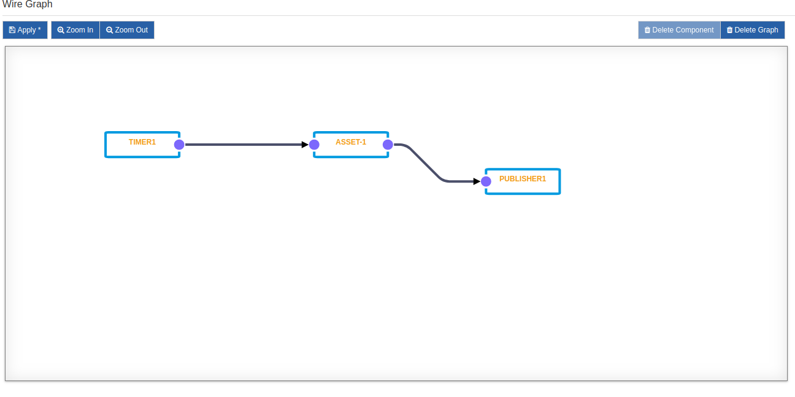

# Kura-Tb-Gateway-Manager
A Kura Bundle to manage the service of Thingsboard Gateway from Kura's web ui.

## Overview
A combination of the the Thingsboard gateway (tb-gw from now on) with Kura's built in Artemis MQTT broker can be set up to forward telemetry data collected on Kura's Assets over modbus, to the Thingsboard IoT platform.
Tb-gw is configured to subscribe to local Artemis MQTT, to which Assets, via Kura's Cloud Service forward their telemetry and everything is set up in the web UI with the help of Kura Wires graphs making it easier to change and test various configurations on the fly.

## Installation

Tb-gw manager bundle:

1. Open Kura web ui.
1. Go to Packages -> Install/Upgrade
1. Select the .dp (deployment package) file from resources/dp in this repo and Submit.
1. The bundle is installed and will appear in packages.
1. Tb-gateway service can be started/stopped from the "EXM Thingsboard Manager" entry  in Kura's configurable services list (bottom left).

ESF modbus driver must also be installed:
1. Open "Packages" section in Kura
1. Open https://marketplace.eclipse.org/content/esf-modbus-driver in a different tab
1. Drag and drop the "Install" button to the Kura tab inside "packages"
1. Confirm "install" if asked.

## Usage

###Configuring Tb-Gateway 
For installation and configuration of the tb-gateway check the official documentation [here](https://thingsboard.io/docs/iot-gateway/getting-started/).

### Setting up Artemis MQTT broker
1. Open Artemis MQTT in Kura's web UI
1. Set "enabled" to true.
1. MQTT address and port must be left at default values (localhost and 1883).
1. Set a username and password which we will need again to configure the Cloud Service (can be left blank)
1. Click "Apply" to save

### Setting up Assets and Channels
Assets are the devices connected to your gateway and channels are their individual inputs (in the case of modbus coils, holding registers etc.). To set up your assets and channels:

1. Go to "Drivers and Assets" and click "New Driver"
1. Under "driver factory" select the driver you just installed, enter a name under "driver name" and click "Apply".
1. Clicking the newly created instance opens its configuration page below. Since the ModBus configuration is on per-instance basis, you can connect both ModBus-TCP/UDP and ModBus-RTU devices at the same time.

Now let's add a first device.

1. Click "New Assets", enter a name, select the newly created driver instance and click "Apply".
1. The new device appears in the list. Select the device by clicking it, to reveal the "Channels" list.
1. Click "New Channel" to add a new channel, enter a name and click "Add".
1. After adding all your channels and configuring them, click "Apply" to save. If the configuration is correct and the devices are connected properly, by clicking the "Data" tab, Kura reads all the configured channels on this asset and displays their current values.

### Setting up the Cloud Service
The cloud service is used by Kura bundles to communicate over various channels including MQTT. 
To configure a cloud service instance:

1. Click Cloud Services in Kura's web ui.
2. Click "new" and in the drop down select "org.eclipse.kura.cloud.CloudService"
3. For cloud service pid enter "org.eclipse.kura.cloud.CloudService-1"
4. Under "MQTT Data transport" set
 - Broker url: "mqtt://localhost:1883" (which is the Artemis MQTT)
 - Username/password: Same values entered when configuring Artemis MQTT
 - Client id: Can be anything
 - Topic: Can be optionally changed, depending on how you configured tb-gw mapping above.
5. Click "Apply" to save
6. Click the intance we just created in the list and click "Connect". If the configuration was correct, "Status" will be "Connected".

Now the cloud service is ready to receive data from Assets and forward it to the Artemis MQTT broker to which the tb-gw is subscribed.

### Setting up a simple graph in Kura Wires
Kura Wires is an easy to use graphical tool to set up your devices and the interactions between them. In this example we will setup one of our assets to be polled at regular intervals for data, which then will be forwarded to the Cloud Service we set up in the previous step for further processing.

1. Open Kura Wires
2. On the right side is the pallete of the available nodes/components. Click on "Timer" and enter a name. When a node is selected you can see its settings on the bottom of the  page. Set the interval in the "simple.interval" field.
3. From the pallete select an "Asset" component. In the window that pop's up you are prompted to select one of the available devices created in the previous steps. At the same time at the bottom of the page you can see the asset's channels and their settings.
4. Add a "Publisher" node. The publisher node represents a Cloud Service instance.
5. Drag and connect the components with wires as seen in the picture below.

By clicking "Apply" the graph is saved and is immediately ran.

